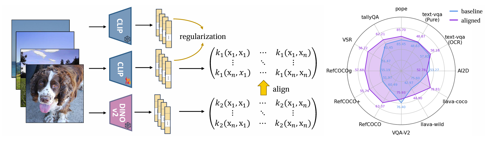

# Kernel-based Unsupervised Embedding Alignment for Enhanced Visual Representation in Vision-language Models
Implementation for ICML 2025 paper [Kernel-based Unsupervised Embedding Alignment for Enhanced Visual Representation 
in Vision-language Models](https://arxiv.org/abs/2506.02557)
by [Shizhan Gong](https://peterant330.github.io/), Yankai Jiang, [Qi Dou](https://www.cse.cuhk.edu.hk/~qdou/), 
and [Farzan Farnia](https://www.cse.cuhk.edu.hk/~farnia/)



## Setup
We recommend to install the environment through conda:

```
cd KUEA
conda env create -f environment.yml -n myenv
conda activate myenv
```

## Alignment Fine-tuning
Please use the following code for the alignment fine-tuning.

```commandline
python -m train.align_training_clip --clip_model_name ViT-L-14 --pretrained openai --dataset imagenet 
--imagenet_root /path/to/imagenet2012 --template std --output_normalize False --steps 40000 --warmup 2800 
--batch_size 64 --loss l2 --loss_clean l2 --opt adamw --lr 1e-5 --wd 1e-4 --inner_loss l2 --wandb False 
--output_dir /path/to/checkpoint --clean_weight 1. --penalty_weight 0.5 --kernel_dino polynomial 
--kernel_clip polynomial --gamma 0.0032 --coef0 0.191623 --experiment_name exp_1  --log_freq 1 --eval_freq 10
```

`--imagenet_root` should be adjusted to designate the directory of the imagenet dataset. `--output_dir` specifies the
directory to store the fine-tuned checkpoint. `--gamma` and `--coef0` are the initial parameters used to calculate the
polynomial kernel of CLIP representations. We pre-calculate them by sampling several images from the training data and
minimize the L2 distance between kernel matrices of CLIP and DINOv2.

## Evaluation
We utilize [CLIP-Benchmark](https://github.com/LAION-AI/CLIP_benchmark) for evaluation of the fine-tuned models.

To evaluate the model, first go to the `CLIP_benchmark` directory

```
cd CLIP_benchmark
```

Edit the file `benchmark/models.txt` to include the model to evaluate:

```commandline
ViT-L-14-336,openai
ViT-L-14-336,directory/to/finetuned/models.pt
```
The first element specify the architecture of the model, and the second element specify the saved checkpoints. Using 
`openai` for evaluation of the original CLIP model. Then run the corresponding bash command:
```commandline
./bash/run_benchmark_clean.sh # zero-shot classification
./bash/run_benchmark_lp.sh # linear probing
./bash/run_benchmark_rt.sh # image-text retrieval
```
Please edit the `SAVE_DIR` field of the corresponding files, which specifies the directory to save the evaluation results.

## Fine-tuning of LLaVA
The script to fine-tune LLaVA is adjusted from [LLaVA](https://github.com/haotian-liu/LLaVA). We use the following
command to perform LoRA fine-tuning
```commandline
cd LLaVA
./scripts/v1_5/finetune_task_lora.sh
```
Note to edit the `--vision_tower` filed of the script to denote the directory of the checkpoints after the alignment fine-tuning.

## Evaluation of LLaVA
We utilize the tool provided by [Prismatic library](https://github.com/TRI-ML/prismatic-vlms) for evaluation of the LLaVA.

## Pre-trained checkpoints
coming soon

## Bibtex
If you find this work helpful, you can cite our paper as follows:
```commandline
@article{gong2025kernel,
  title={Kernel-based Unsupervised Embedding Alignment for Enhanced Visual Representation in Vision-language Models},
  author={Gong, Shizhan and Jiang, Yankai and Dou, Qi and Farnia, Farzan},
  journal={arXiv preprint arXiv:2506.02557},
  year={2025}
}
```

## Contact
For any questions, please contact [szgong22@cse.cuhk.edu.hk](szgong22@cse.cuhk.edu.hk)

